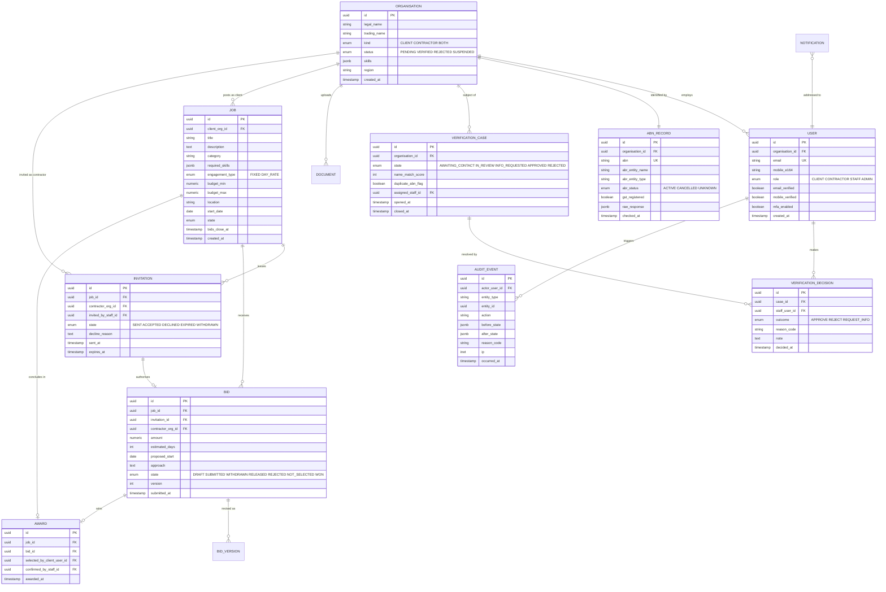
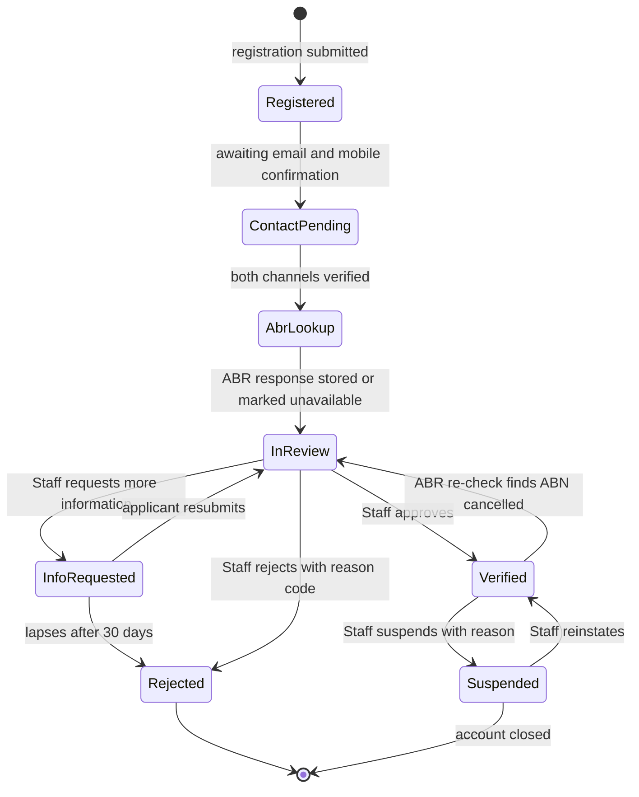
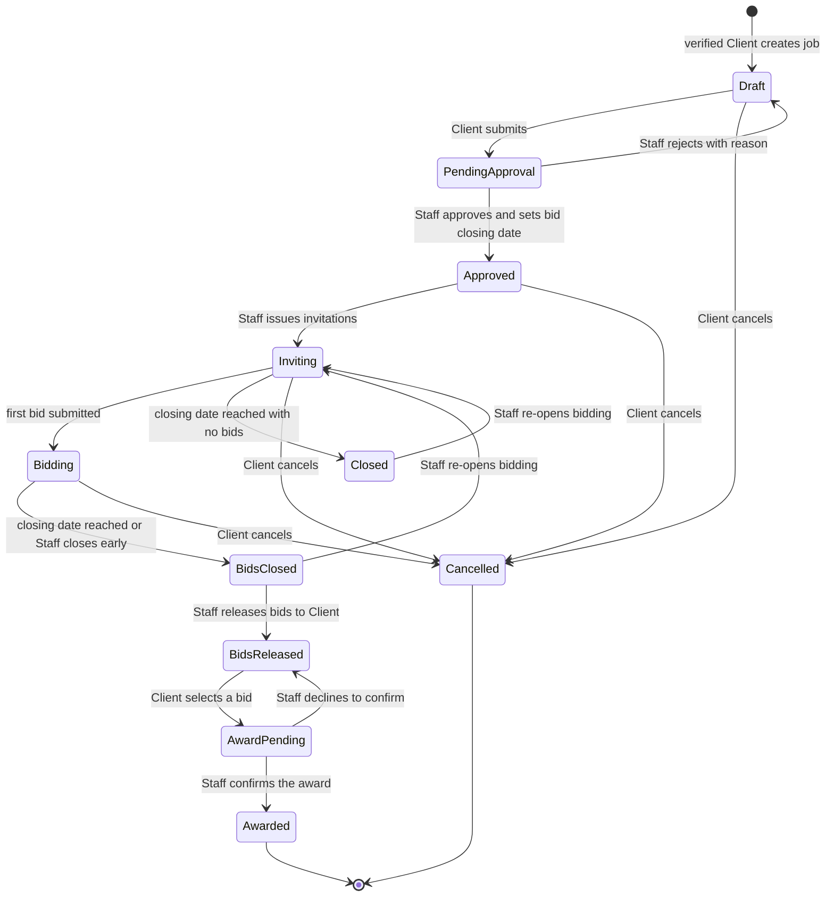
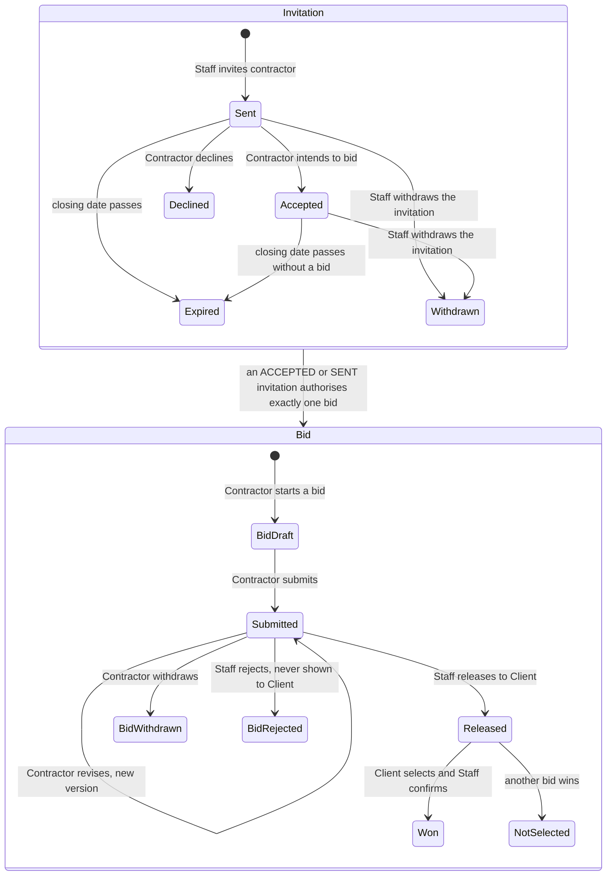
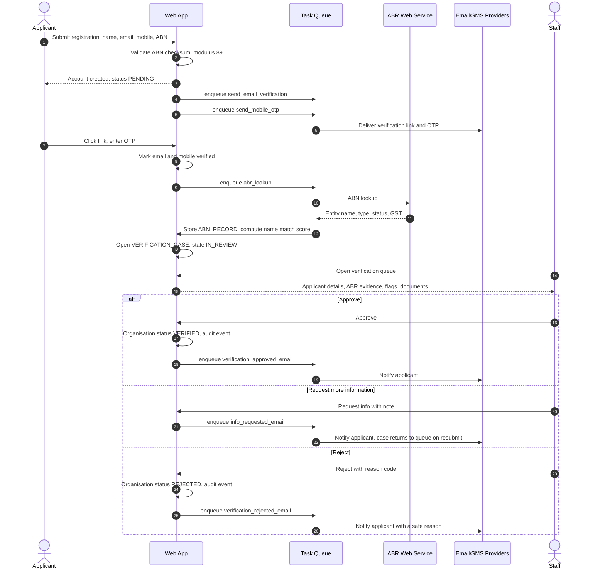
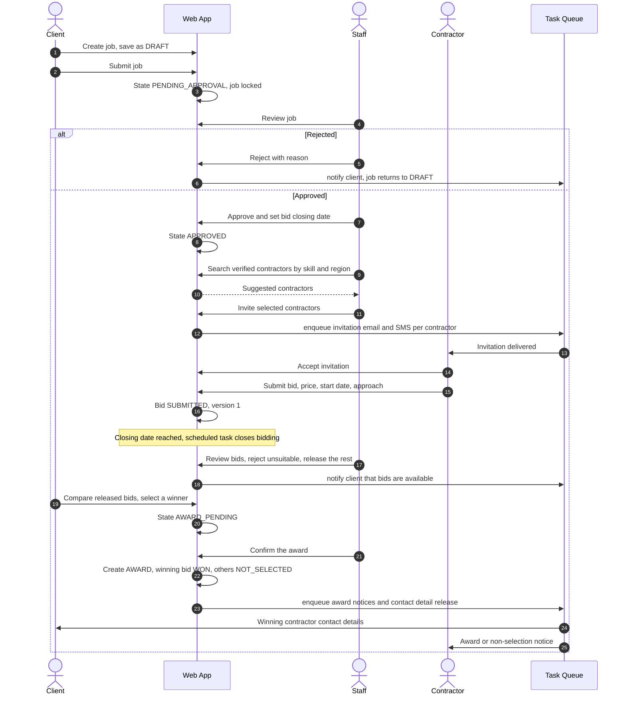
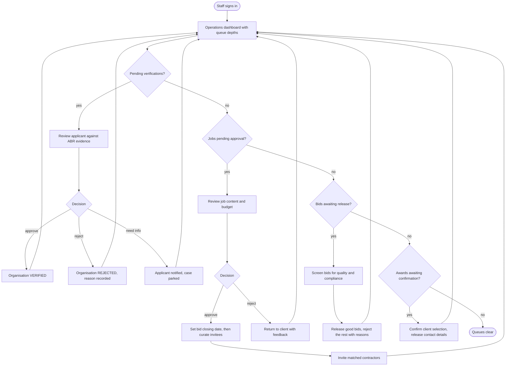
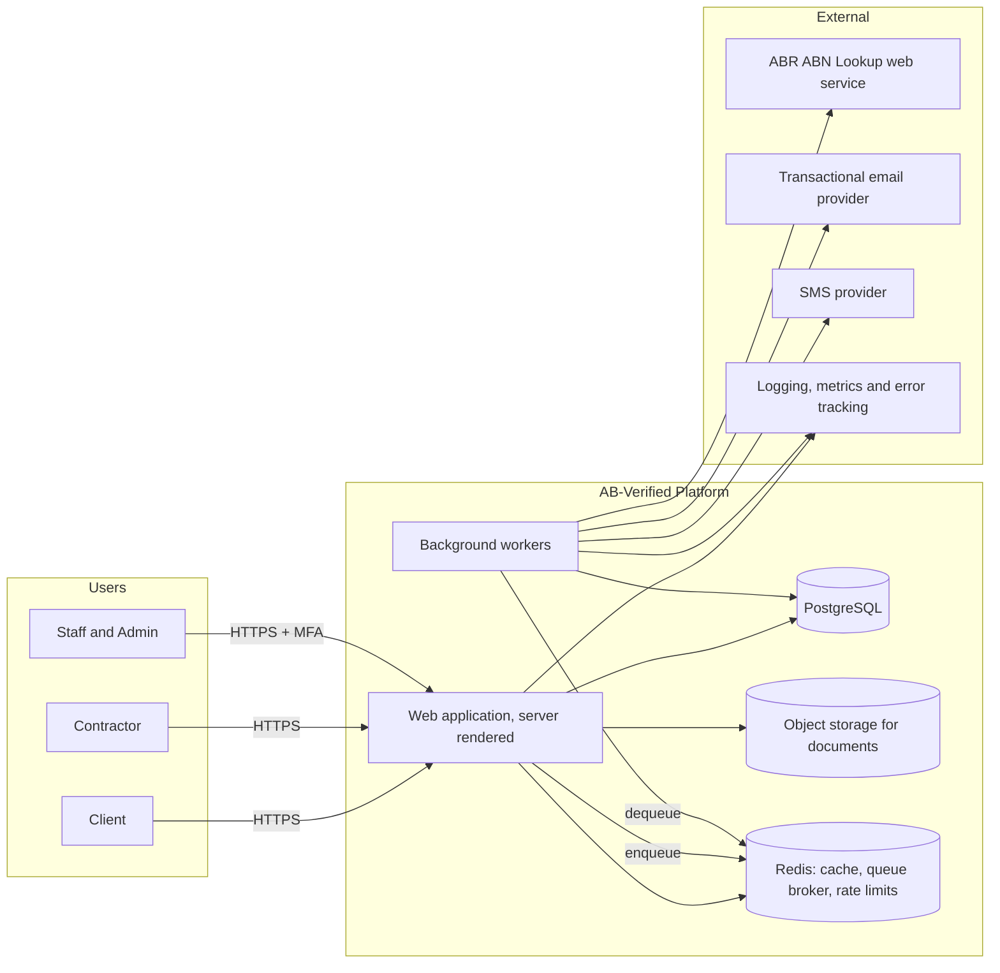
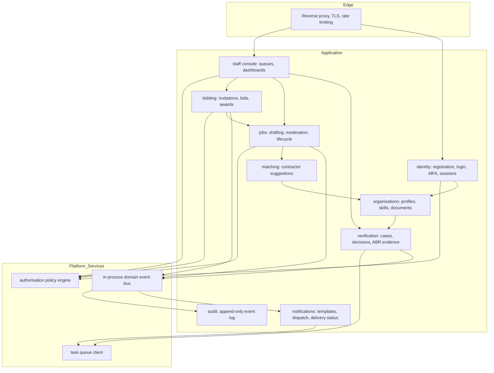
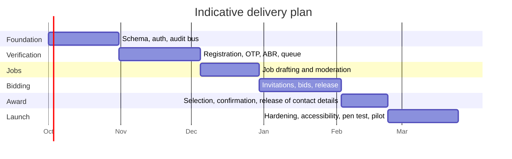

# AB-Verified — Curated IT Marketplace Specification

**Status:** Draft v0.1 · **Date:** 2026-09-09 · **Scope:** Specification only — no implementation

---

## 1. Overview

AB-Verified is a small, staff-mediated IT marketplace for the Australian market. Clients post IT jobs; Contractors bid on them. Unlike an open marketplace, **every meaningful transition is gated by Staff**: Staff verify that Clients and Contractors are legitimate businesses, Staff approve jobs before they go live, and Staff explicitly invite Contractors to bid on a given job.

This curated model is the defining architectural constraint. It means:

- The system is a **workflow engine with a marketplace UI**, not a marketplace with an admin panel bolted on.
- Discovery is **push, not pull** — Contractors do not browse an open job board; they receive invitations.
- Every state transition needs an **actor, a timestamp, a reason and an audit record**, because Staff decisions are commercially consequential and may be disputed.

### 1.1 Goals

| # | Goal |
|---|------|
| G1 | Only verified, real Australian businesses transact on the platform. |
| G2 | Staff retain control over which jobs go live and who is invited to bid. |
| G3 | Clients receive a small, curated set of quality bids rather than bid spam. |
| G4 | Every decision is auditable and explainable after the fact. |
| G5 | The platform is operable by a very small team (1–3 staff) at launch. |

### 1.2 Non-Goals (v1)

- No payments, escrow, invoicing or milestone billing.
- No public job board or SEO-indexed listings.
- No in-app messaging between Client and Contractor — contact details are released on award.
- No ratings, reviews or reputation scores.
- No native mobile applications.
- No multi-currency or non-Australian entity support.

### 1.3 Assumptions

- Australian businesses only; every registering party has an ABN.
- Verification is **human-in-the-loop, assisted by automation** — an ABR lookup informs the Staff decision but never replaces it.
- Launch volume is low: hundreds of users and jobs, not millions. This justifies a single relational database and a modular monolith.

---

## 2. Personas & Roles

| Persona | Description | Primary interest |
|---|---|---|
| **Client** | An Australian business needing IT work delivered. Registers, is verified, posts jobs, reviews bids, selects a winner. | Trustworthy contractors, quickly. |
| **Contractor** | An IT services business or sole trader. Registers, is verified, is invited to bid, submits bids. | Relevant, pre-qualified work. |
| **Staff** | Platform operator. Verifies registrations, moderates jobs, curates the invite list per job, approves or rejects. | Keep the marketplace clean and matched. |
| **Admin** | A Staff member with elevated rights: manage staff accounts, override decisions, read the full audit log. | Governance and recovery. |
| **System** | Scheduled work and integrations: ABR lookups, email/SMS dispatch, invitation and bid expiry. | Reliability. |

### 2.1 Role–Permission Matrix

| Capability | Client | Contractor | Staff | Admin |
|---|:--:|:--:|:--:|:--:|
| Register, verify own email and mobile | ✅ | ✅ | — | — |
| Submit ABN and verification documents | ✅ | ✅ | — | — |
| View own verification status and reasons | ✅ | ✅ | ✅ | ✅ |
| Approve / reject a registration | — | — | ✅ | ✅ |
| Create / edit a draft job | ✅ own | — | ✅ | ✅ |
| Approve / reject a job | — | — | ✅ | ✅ |
| Invite contractors to bid | — | — | ✅ | ✅ |
| Submit / withdraw a bid | — | ✅ invited only | — | — |
| View bids on a job | ✅ own job, post-release | ✅ own bid only | ✅ | ✅ |
| Award a job | ✅ own job, pending confirmation | — | ✅ | ✅ |
| Suspend a user or organisation | — | — | ✅ | ✅ |
| Manage staff accounts | — | — | — | ✅ |
| Read audit log | — | — | ✅ scoped | ✅ all |
| Override or reverse any decision | — | — | — | ✅ |

> **Hard rule:** a Contractor can *never* see a job they were not invited to. Authorisation is enforced in the data-access layer, not only in the UI.

---

## 3. Functional Requirements

Priorities use MoSCoW: **M** = Must, **S** = Should, **C** = Could.

### 3.1 Registration & Identity — FR-100

| ID | Requirement | Pri |
|---|---|:--:|
| FR-101 | A visitor registers by choosing an account type (Client or Contractor) and supplying legal/business name, contact name, email, Australian mobile number, ABN and a password. | M |
| FR-102 | Email is verified by a single-use, time-limited link with a 24-hour TTL. | M |
| FR-103 | Mobile is verified by a 6-digit OTP SMS, valid 10 minutes, maximum 5 attempts and 3 resends per hour. | M |
| FR-104 | The ABN is validated **structurally** on submission using the ATO modulus-89 checksum before any external call is made. | M |
| FR-105 | The ABN is validated **externally** against the Australian Business Register web service; the system stores the returned entity name, entity type, GST registration status, ABN status and lookup timestamp. | M |
| FR-106 | An ABN may be attached to at most one active organisation. A second registration using the same ABN is flagged for Staff rather than silently rejected. | M |
| FR-107 | An organisation may hold both Client and Contractor roles under one ABN. Verification happens once per organisation; role-specific requirements are additive. | S |
| FR-108 | Passwords must be at least 12 characters and are checked against a breached-password corpus. | M |
| FR-109 | Staff and Admin accounts are created by invitation only and require TOTP multi-factor authentication. | M |
| FR-110 | A Contractor may upload supporting documents — certificate of currency, professional indemnity insurance, licences, certifications. | S |
| FR-111 | If the ABR lookup fails or times out, registration still proceeds to the Staff queue, marked `ABR_UNAVAILABLE`, and the lookup is retried by a background task. | M |

### 3.2 Staff Verification — FR-200

| ID | Requirement | Pri |
|---|---|:--:|
| FR-201 | A registration enters the Staff verification queue only once **both** email and mobile are verified and an ABR lookup has been attempted. | M |
| FR-202 | The queue shows per applicant: submitted details, ABR response, a name-similarity score between the submitted business name and the ABR entity name, duplicate-ABN flags, and uploaded documents. | M |
| FR-203 | Staff may **Approve**, **Reject** or **Request more information**; each requires a reason code and permits a free-text note. | M |
| FR-204 | Registration rejection reason codes: `ABN_NOT_FOUND`, `ABN_INACTIVE`, `NAME_MISMATCH`, `DUPLICATE_ENTITY`, `INSUFFICIENT_DOCUMENTS`, `SUSPECTED_FRAUD`, `OUT_OF_SCOPE`, `OTHER`. | M |
| FR-205 | "Request more information" returns the applicant to an editable state, notifies them with the Staff note, and returns them to the queue on resubmission. | M |
| FR-206 | A rejected applicant is notified with a human-readable reason. `SUSPECTED_FRAUD` is never disclosed verbatim — a generic message is sent instead. | M |
| FR-207 | Only a **verified** Client may post a job; only a **verified** Contractor may be invited or bid. | M |
| FR-208 | Staff may suspend or reinstate an organisation at any time, with a reason. Suspension immediately blocks new jobs, invitations and bids but preserves all history. | M |
| FR-209 | Verification decisions are immutable. A change of mind is recorded as a new decision superseding the previous one. | M |
| FR-210 | Active organisations are re-checked against the ABR periodically; a change to `CANCELLED` re-opens a verification case. | C |
| FR-211 | The queue supports assignment, so two Staff do not review the same applicant simultaneously. | S |

### 3.3 Jobs — FR-300

| ID | Requirement | Pri |
|---|---|:--:|
| FR-301 | A verified Client creates a job with title, description, category, required skills, engagement type (fixed price or day rate), budget range, location or "remote", start date and expected duration. | M |
| FR-302 | A job may be saved as a draft and edited freely while in `DRAFT`. | M |
| FR-303 | Submitting a job moves it to `PENDING_APPROVAL` and locks it against Client edits. | M |
| FR-304 | Staff **approve** or **reject** a job with a reason code. Rejection returns it to `DRAFT` with feedback. | M |
| FR-305 | Job rejection reason codes: `INCOMPLETE`, `OUT_OF_SCOPE`, `UNREALISTIC_BUDGET`, `CONTAINS_CONTACT_DETAILS`, `DUPLICATE`, `POLICY_BREACH`, `OTHER`. | M |
| FR-306 | Staff may redact or edit a job before approval; the original text is retained in the audit log. | S |
| FR-307 | An approved job carries a **bid closing date**, set by Staff at approval time. | M |
| FR-308 | A Client may cancel a job at any pre-award state, with a reason. Invited Contractors are notified. | M |
| FR-309 | Jobs are never publicly listed or indexed. Access is by authenticated, authorised request only. | M |

### 3.4 Invitations & Bidding — FR-400

| ID | Requirement | Pri |
|---|---|:--:|
| FR-401 | Staff select verified Contractors to invite to an approved job. The system *suggests* candidates by skill, category and location match, but selection is always a Staff act. | M |
| FR-402 | Each invitation has its own state and expiry, defaulting to the job's bid closing date. | M |
| FR-403 | An invited Contractor is notified by email and SMS and may **Accept** (intend to bid), **Decline** with an optional reason, or let the invitation lapse. | M |
| FR-404 | Only a Contractor holding a `SENT` or `ACCEPTED` invitation may submit a bid on that job. | M |
| FR-405 | A bid contains price (or day rate and estimated days), proposed start date, estimated duration, an approach note and optional attachments. | M |
| FR-406 | A Contractor may edit or withdraw a bid until the bid closing date; every version is retained. | M |
| FR-407 | Contractors cannot see other Contractors' bids, nor the number or identity of other invitees. | M |
| FR-408 | Staff review submitted bids and **release** them to the Client, individually or in bulk. Staff may reject a bid with a reason so that it is never shown. | M |
| FR-409 | A Client sees only released bids, and only after the bid closing date or an explicit Staff release. | M |
| FR-410 | The Client selects a winning bid; the selection requires Staff confirmation to become an award. | M |
| FR-411 | On award, contact details are released to both parties, all other bids move to `NOT_SELECTED`, and those Contractors are notified. | M |
| FR-412 | Staff may re-open bidding on a job — for instance when every bid is rejected or the awarded Contractor withdraws. | S |
| FR-413 | Invitations and bids expire automatically at their closing datetime via a scheduled task; expiry is an auditable system action. | M |

### 3.5 Notifications — FR-500

| ID | Requirement | Pri |
|---|---|:--:|
| FR-501 | Transactional email is sent for email verification, verification outcome, job approval or rejection, invitation, bid release, award and non-selection. | M |
| FR-502 | SMS is sent for mobile OTP, invitation received and award. SMS is deliberately reserved for time-critical events. | M |
| FR-503 | All notifications are queued and retried with exponential backoff; delivery status is recorded per message. | M |
| FR-504 | Users may opt out of non-transactional SMS, but not out of OTP or award notices. | S |
| FR-505 | Staff receive a digest of queue depths: pending verifications, pending job approvals, bids awaiting release. | S |

### 3.6 Audit & Administration — FR-600

| ID | Requirement | Pri |
|---|---|:--:|
| FR-601 | Every state transition writes an append-only audit record: actor, role, action, entity, before and after state, reason code, note, IP, user agent, timestamp. | M |
| FR-602 | Audit records are immutable; corrections are new records. | M |
| FR-603 | Admins can view a full timeline for any organisation, user, job, invitation or bid. | M |
| FR-604 | Staff may not act on records belonging to their own organisation — a conflict-of-interest guard. | S |
| FR-605 | ABR lookup requests and responses are retained verbatim as evidence. | M |

---

## 4. Non-Functional Requirements

| ID | Category | Requirement |
|---|---|---|
| NFR-01 | Availability | 99.5% monthly for the authenticated application; a single region is acceptable at launch. |
| NFR-02 | Performance | P95 server render under 500 ms; Staff queue pages under 1 s with 1,000 rows. |
| NFR-03 | Scale target | 5,000 organisations, 20,000 jobs, 100,000 bids within three years — comfortably single-node PostgreSQL. |
| NFR-04 | Security | OWASP ASVS Level 2. TLS 1.2+ everywhere. Argon2id password hashing. Server-side sessions with `HttpOnly`, `Secure`, `SameSite=Lax` cookies. |
| NFR-05 | Authorisation | Deny by default, enforced in the data-access layer. Every list query is scoped by actor. |
| NFR-06 | Privacy | Privacy Act 1988 and the Australian Privacy Principles. Data resident in an Australian region. Verification documents encrypted at rest with a customer-managed key. |
| NFR-07 | Retention | Verification documents purged seven years after account closure; audit records retained seven years; OTPs and tokens purged on use or expiry. |
| NFR-08 | Rate limiting | Per-IP and per-account limits on login, OTP request, ABN lookup and registration. |
| NFR-09 | Accessibility | WCAG 2.2 AA across all Client- and Contractor-facing pages. |
| NFR-10 | Observability | Structured JSON logs, request tracing, error tracking, and a business dashboard covering queue depth, time-to-verify and bids per job. |
| NFR-11 | Backup & DR | Daily full backup plus point-in-time recovery. RPO 5 minutes, RTO 4 hours. Restores rehearsed quarterly. |
| NFR-12 | Data integrity | No hard deletes on domain entities; soft-delete with tombstones. |
| NFR-13 | Localisation | en-AU, Australia/Sydney for display, UTC in storage, AUD currency. |
| NFR-14 | Maintainability | One deployable unit; a new engineer runs the entire stack locally with a single command. |
| NFR-15 | Testability | Every state machine has exhaustive transition tests, including illegal transitions. |

---

## 5. Domain Model

### 5.1 Key modelling decisions

1. **The organisation is the verified unit, not the user.** An ABN belongs to a business; people come and go. This makes FR-107 (one organisation, both roles) natural and avoids re-verifying every new employee.
2. **`VERIFICATION_CASE` is separate from `ORGANISATION.status`.** The case is the workflow record with its own history; the status column on the organisation is the denormalised, queryable current answer.
3. **`INVITATION` authorises `BID`.** Making the invitation a first-class entity with a foreign key on the bid turns "may this contractor bid?" into a schema-level constraint rather than application logic that can be forgotten.
4. **Bids are versioned.** FR-406 permits edits, and disputes require knowing what was offered and when.
5. **`AWARD` is a distinct entity** requiring both a client selector and a staff confirmer, encoding FR-410 in the schema instead of implying it.

---

## 6. State Machines

### 6.1 Organisation verification

### 6.2 Job lifecycle

### 6.3 Invitation and bid lifecycle

---

## 7. Key Flows

### 7.1 Registration and verification

### 7.2 Job posting through to award

### 7.3 Staff daily operating loop

---

## 8. Architecture

### 8.1 System context

### 8.2 Internal module structure

A **modular monolith**: one deployable unit, hard internal boundaries. Modules communicate through published service functions and domain events, never by reaching into each other's tables.

### 8.3 Architectural principles

| # | Principle | Consequence |
|---|---|---|
| A1 | **State transitions are the domain.** | Each aggregate exposes explicit transition functions; no view or template ever sets a status field directly. |
| A2 | **Deny by default authorisation.** | A single policy layer answers "may actor X do Y to Z?" Views call it; querysets are scoped through it. |
| A3 | **Audit as a side effect of the event bus.** | Every transition emits a domain event; the audit module subscribes. Auditing cannot be forgotten in a new feature. |
| A4 | **Outbound integrations are always asynchronous.** | ABR, email and SMS run in workers with retries, so a provider outage never blocks a user request (FR-111). |
| A5 | **The monolith stays modular until measured pain.** | At this scale, extracting services costs more than it saves. Module boundaries make later extraction cheap if needed. |
| A6 | **Server-rendered HTML with progressive enhancement.** | No JavaScript build pipeline; the application works with JavaScript disabled and is fast on poor connections. |

---

## 9. Suggested Stack

The constraint is explicit: **no Node.js anywhere** — not in the runtime, and not in the build toolchain. That rules out React, Vue, Next.js, Vite, webpack, PostCSS and the Tailwind npm package. The recommendation below therefore uses a server-rendered architecture with hypermedia interactivity and standalone, single-binary asset tooling.

### 9.1 Recommended: Python + Django

| Layer | Choice | Rationale |
|---|---|---|
| Language | **Python 3.13** | Large Australian hiring pool; excellent library coverage for SOAP/JSON integration and document handling. |
| Web framework | **Django 5.x** | The single biggest fit factor: `django-admin` gives Staff a credible verification and moderation console on day one, and the ORM, migrations, auth, permissions, CSRF and form validation are batteries-included. This project is 70% admin workflow. |
| Interactivity | **htmx + Alpine.js** (served as static vendored files, no npm) | Delivers partial-page updates, queue filtering, inline approvals and modals without a JavaScript build step. |
| CSS | **Tailwind CSS standalone CLI** (single Go binary) or **PicoCSS/Bulma** vendored | Tailwind ships a precompiled standalone binary that needs no Node.js — this is the specific detail that makes "no Node" workable with a modern CSS workflow. |
| Database | **PostgreSQL 16** | Transactional integrity for state machines, JSONB for ABR payloads and skill sets, full-text search for contractor matching, row-level constraints. |
| Task queue | **Celery + Redis**, or **Django-Q2** for a lighter footprint | Async ABR lookups, email/SMS dispatch, scheduled expiry of invitations and bids. |
| Scheduling | **Celery Beat** | Bid closing, invitation expiry, ABR re-checks, staff digests. |
| Object storage | **S3-compatible** (AWS S3 Sydney, or MinIO locally) | Verification documents and bid attachments, server-side encrypted, accessed by short-lived signed URLs. |
| Email | **Amazon SES** (ap-southeast-2) or Postmark | Transactional deliverability with webhook delivery status. |
| SMS | **Twilio** or **Amazon SNS** | OTP and time-critical invitation and award notices. |
| Auth | Django auth + **django-otp** (TOTP) + **django-axes** (lockout) | FR-109 MFA for staff, brute-force protection. |
| ABN validation | Local modulus-89 checksum + **ABR ABN Lookup web service** (`zeep` for SOAP, or the JSON endpoint) | FR-104 and FR-105; requires a free registered GUID from the ABR. |
| Testing | pytest, pytest-django, factory-boy, Playwright for Python | State-machine transition tests and end-to-end staff workflows. |
| Quality | ruff, mypy, django-stubs, bandit, pip-audit | Static analysis and dependency scanning in CI. |
| Packaging | **uv** for dependency management, Docker image | Reproducible builds, one-command local setup (NFR-14). |
| Hosting | Docker on **AWS ap-southeast-2** (ECS Fargate or a single EC2 with Docker Compose), RDS PostgreSQL, ElastiCache Redis | Australian data residency (NFR-06). Fly.io Sydney is a lower-cost alternative. |
| Observability | Sentry, OpenTelemetry, CloudWatch or Grafana Cloud | NFR-10. |
| CI/CD | GitHub Actions: ruff, mypy, pytest, migration check, image build, deploy | — |

### 9.2 Alternatives considered

| Option | Verdict |
|---|---|
| **Go + templ + htmx** | Excellent single-binary deployment and performance, but no admin scaffolding — the Staff console would be hand-built, which is precisely where most of this system's value lives. Choose if the team is already strong in Go. |
| **C# / .NET 9 + ASP.NET Core Razor Pages** | A very strong second choice: first-class typing, Identity, EF Core, and mature Azure hosting in Australia East. Pick this if the team is Microsoft-oriented; the admin console still needs building, though scaffolding helps. |
| **Ruby on Rails + Hotwire** | Comparable productivity to Django, and Hotwire is the closest peer to htmx. Weaker built-in admin than Django unless a gem such as Avo is added. Note that importmap-rails avoids Node, but some Rails tooling still assumes it. |
| **PHP / Laravel + Livewire + Filament** | Filament is arguably the best admin panel in any ecosystem and is a genuinely strong fit. Cheapest hosting. Chosen against only because the Python ecosystem has a deeper hiring pool for this team. |
| **Any SPA framework** | Excluded by the no-Node constraint, and unjustified regardless: this application is forms, queues and tables, where server-rendered HTML is simpler and faster to ship. |

### 9.3 Why this stack fits the requirements

- **FR-200 series** — Django's admin plus custom Staff views deliver the verification queue, assignment and decision recording with far less code than any alternative.
- **FR-601 audit** — Django signals and a domain event bus make append-only auditing structural rather than optional.
- **FR-111 / A4** — Celery gives retries and dead-lettering for the ABR integration for free.
- **NFR-05** — Django's queryset layer is the natural place to enforce actor-scoped access so a Contractor's query cannot return an uninvited job.
- **No Node** — htmx, Alpine and the Tailwind standalone binary provide a modern UI with zero JavaScript toolchain.

---

## 10. Interface Sketch

REST-ish server-rendered routes; htmx requests hit the same routes and receive HTML fragments. A JSON API is deferred to v2.

| Method | Path | Actor | Purpose |
|---|---|---|---|
| `POST` | `/register` | Public | Create organisation and first user |
| `GET` | `/verify/email/{token}` | Public | Confirm email |
| `POST` | `/verify/mobile` | Authenticated | Submit OTP |
| `GET` | `/dashboard` | Client, Contractor | Role-appropriate home |
| `POST` | `/jobs` | Client | Create draft job |
| `POST` | `/jobs/{id}/submit` | Client | Move to `PENDING_APPROVAL` |
| `POST` | `/jobs/{id}/cancel` | Client | Cancel with reason |
| `GET` | `/invitations` | Contractor | List own invitations |
| `POST` | `/invitations/{id}/accept` | Contractor | Accept |
| `POST` | `/invitations/{id}/decline` | Contractor | Decline with reason |
| `POST` | `/jobs/{id}/bids` | Contractor | Submit or revise a bid |
| `POST` | `/bids/{id}/withdraw` | Contractor | Withdraw |
| `GET` | `/jobs/{id}/bids` | Client | Released bids only |
| `POST` | `/jobs/{id}/select/{bid_id}` | Client | Select a winner, `AWARD_PENDING` |
| `GET` | `/staff/verifications` | Staff | Verification queue |
| `POST` | `/staff/verifications/{id}/decide` | Staff | Approve, reject or request info |
| `GET` | `/staff/jobs/pending` | Staff | Job moderation queue |
| `POST` | `/staff/jobs/{id}/decide` | Staff | Approve with closing date, or reject |
| `GET` | `/staff/jobs/{id}/candidates` | Staff | Suggested contractors |
| `POST` | `/staff/jobs/{id}/invite` | Staff | Issue invitations |
| `POST` | `/staff/bids/{id}/release` | Staff | Release a bid to the client |
| `POST` | `/staff/bids/{id}/reject` | Staff | Reject a bid with reason |
| `POST` | `/staff/jobs/{id}/confirm-award` | Staff | Confirm the award |
| `POST` | `/staff/organisations/{id}/suspend` | Staff | Suspend with reason |
| `GET` | `/admin/audit/{entity_type}/{id}` | Admin | Full entity timeline |

---

## 11. Security & Privacy Notes

- **Contact detail embargo.** Email addresses and phone numbers of the counterparty are withheld until award (FR-411). Job and bid free-text is scanned for email addresses and phone numbers at submission and flagged for Staff (`CONTAINS_CONTACT_DETAILS`), since embargo is otherwise trivially bypassed.
- **Enumeration resistance.** Registration and password reset return identical responses whether or not an account exists. Job, bid and invitation identifiers are UUIDv7 rather than sequential integers.
- **File uploads.** Verification documents and bid attachments are restricted by type and size, stored outside the web root, served only through short-lived signed URLs, and scanned for malware before Staff view them.
- **Staff privilege.** Staff hold broad read access to commercially sensitive bids. This is mitigated by mandatory MFA, per-action audit logging, the conflict-of-interest guard (FR-604), and an Admin-visible report of unusual Staff read volume.
- **ABR credentials.** The ABR GUID is a secret held in a managed secret store, never in source control, and its use is rate-limited per the ABR terms of service.
- **Personal information.** ABNs, mobile numbers and uploaded documents are personal information under the Privacy Act. A retention schedule (NFR-07) and a documented access-and-correction process are prerequisites for launch.

---

## 12. Delivery Plan

| Milestone | Exit criteria |
|---|---|
| **M1 Foundation** | Schema migrated, authentication and MFA working, audit events emitted for every transition, CI green. |
| **M2 Verification** | An applicant can register, verify email and mobile, be looked up against the ABR, and be approved or rejected by Staff with a reason. |
| **M3 Jobs** | A verified Client can draft and submit a job; Staff can approve with a bid closing date or reject with feedback. |
| **M4 Bidding** | Staff can invite matched Contractors; Contractors can accept and bid; Staff can release or reject bids. |
| **M5 Award** | Client selects, Staff confirms, contact details are released, and losing bidders are notified. |
| **M6 Launch** | WCAG 2.2 AA audit passed, penetration test remediated, backup restore rehearsed, pilot cohort onboarded. |

---

## 13. Open Questions

| # | Question | Impact |
|---|---|---|
| Q1 | Is a Client permitted to see the identity of bidding Contractors before award, or only anonymised profiles? | Changes bid release UI and the contact embargo rules. |
| Q2 | Can a Contractor request an invitation to a job they have heard about, or is push-only absolute? | Adds an entire "expression of interest" flow if permitted. |
| Q3 | Are sole traders without a registered business name in scope? The ABR entity name for an individual is a personal name, which will systematically depress the name-match score. | Affects FR-202 scoring and the rejection rate. |
| Q4 | What is the target Staff response time, and does it need to be a published SLA? | Drives queue alerting and possibly out-of-hours staffing. |
| Q5 | Does the platform take a commission, and if so is it recorded at award time even though payments are out of scope? | Adds a commercial-terms field to `AWARD`. |
| Q6 | Should Staff be able to invite a Contractor who is not yet verified, triggering an expedited verification? | Adds a state to both the invitation and verification machines. |
| Q7 | Is ABN Lookup sufficient evidence, or is director or identity verification also required for higher-value jobs? | Could introduce a tiered verification model. |
| Q8 | What happens commercially if an awarded engagement collapses — does the platform re-open bidding automatically? | Extends FR-412 beyond a manual Staff action. |
