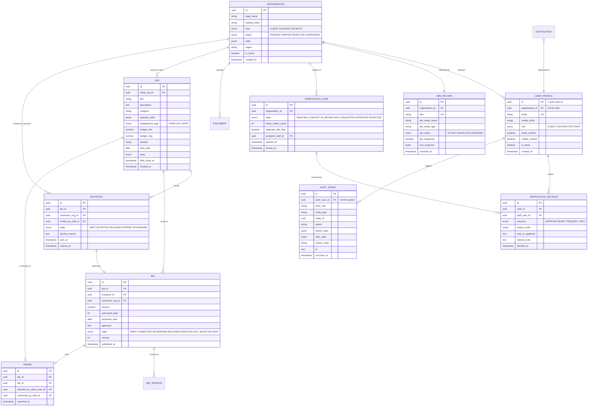
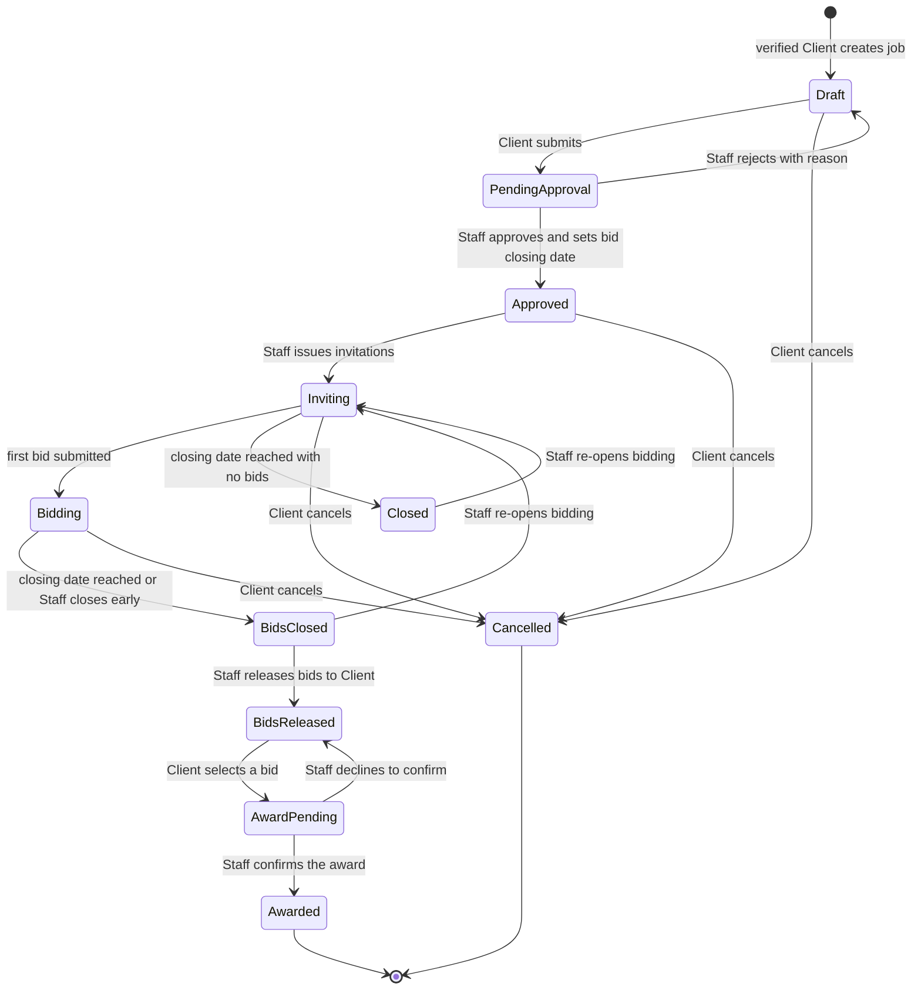
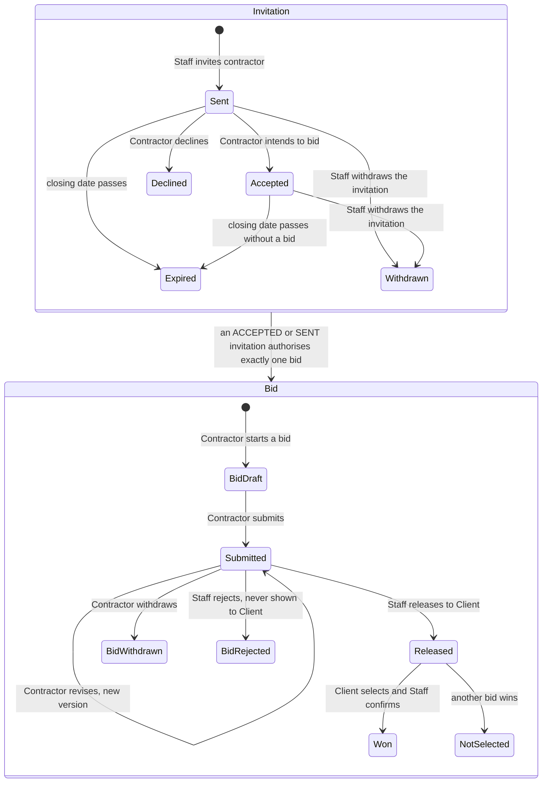
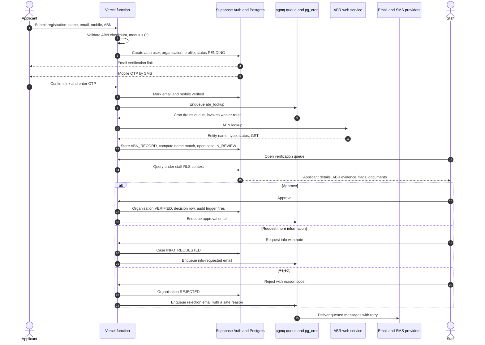
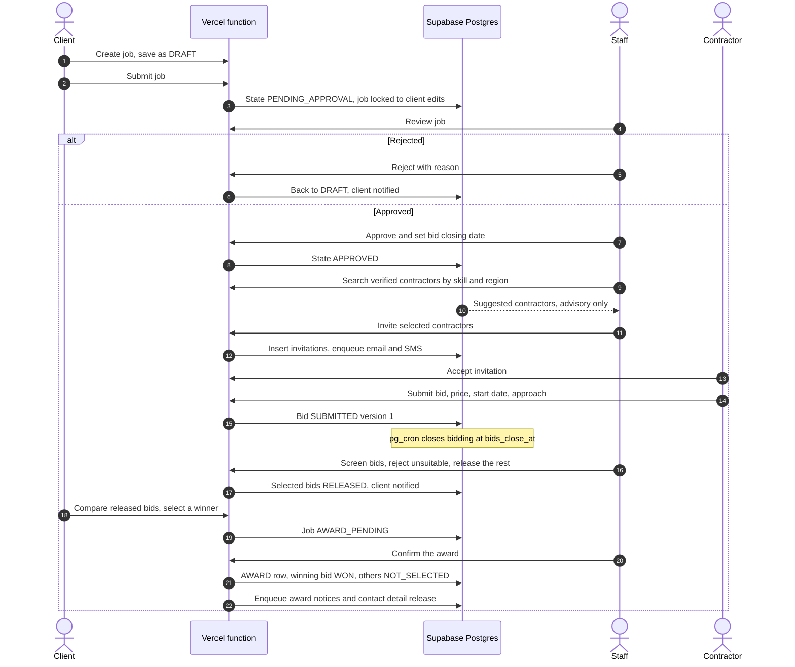
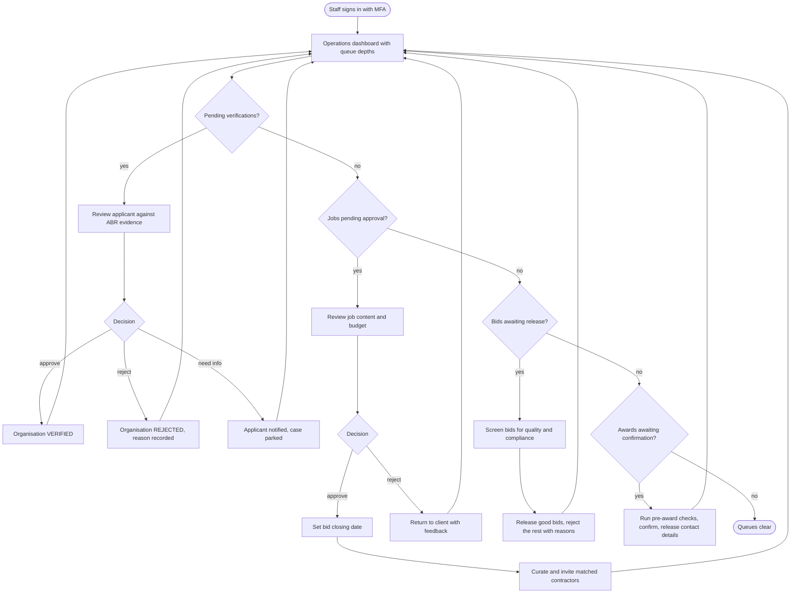
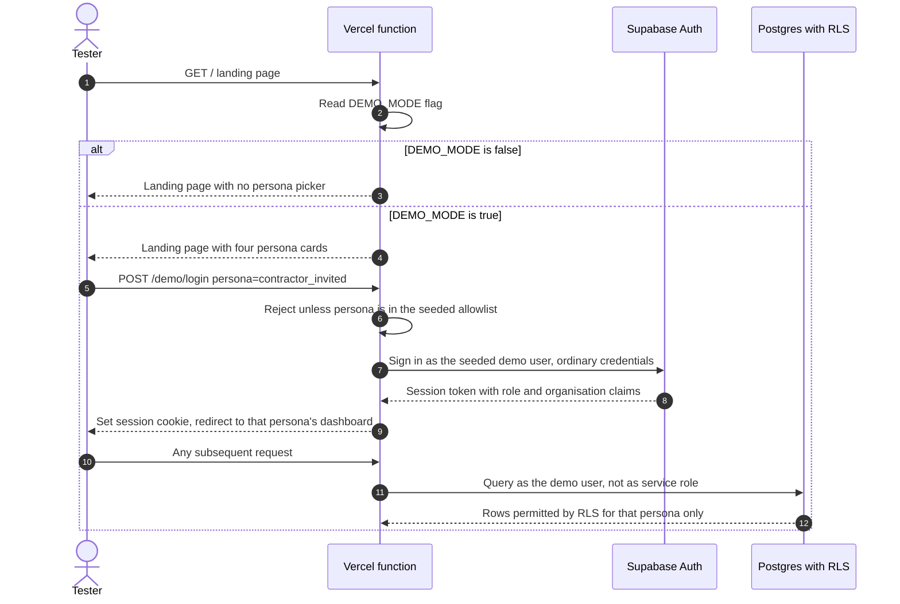
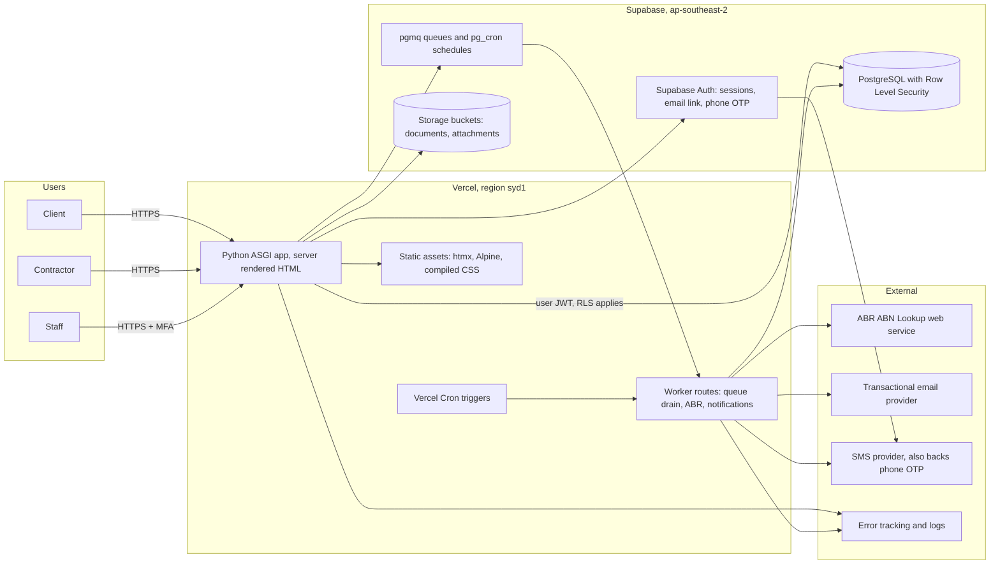
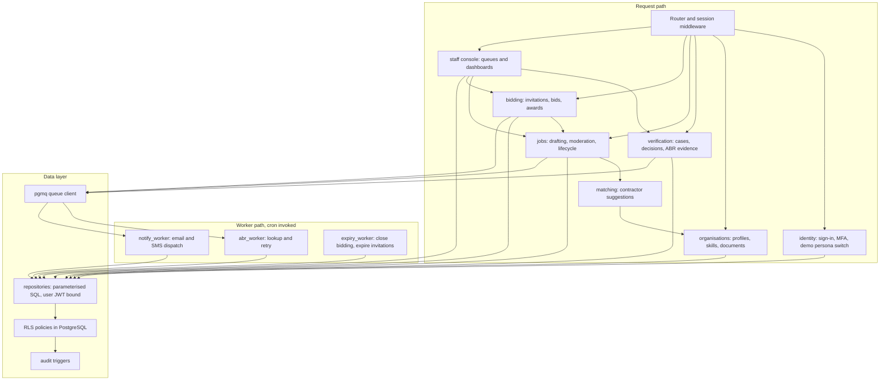
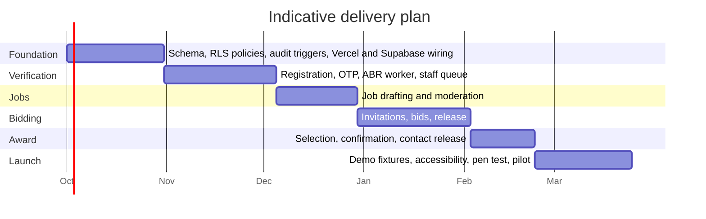

# AB-Verified: Curated IT Marketplace Specification

**Status:** Draft v0.2 · **Date:** 2026-09-09 · **Scope:** Specification only, no implementation

> **Companion document:** [`wireframes/index.html`](wireframes/index.html) holds low-fidelity HTML wireframes for every screen referenced here. Open it in a browser.

---

## 1. Overview

AB-Verified is a small, staff-mediated IT marketplace for the Australian market. Clients post IT jobs; Contractors bid on them. Unlike an open marketplace, **every meaningful transition is gated by Staff**: Staff verify that Clients and Contractors are legitimate businesses, Staff approve jobs before they go live, and Staff explicitly invite Contractors to bid on a given job.

This curated model is the defining architectural constraint. It means:

- The system is a **workflow engine with a marketplace UI**, not a marketplace with an admin panel bolted on.
- Discovery is **push, not pull**: Contractors do not browse an open job board; they receive invitations.
- Every state transition needs an **actor, a timestamp, a reason and an audit record**, because Staff decisions are commercially consequential and may be disputed.

### 1.1 Goals

| # | Goal |
|---|------|
| G1 | Only verified, real Australian businesses transact on the platform. |
| G2 | Staff retain control over which jobs go live and who is invited to bid. |
| G3 | Clients receive a small, curated set of quality bids rather than bid spam. |
| G4 | Every decision is auditable and explainable after the fact. |
| G5 | The platform is operable by a very small team (1–3 staff) at launch. |

### 1.2 Non-Goals (v1)

- No payments, escrow, invoicing or milestone billing.
- No public job board or SEO-indexed listings.
- No in-app messaging between Client and Contractor: contact details are released on award.
- No ratings, reviews or reputation scores.
- No native mobile applications.
- No multi-currency or non-Australian entity support.

### 1.3 Platform constraints

These are fixed inputs to the design, not conclusions drawn from it.

| # | Constraint | Consequence |
|---|---|---|
| PC1 | **No Node.js**, in the runtime or the build toolchain. | Rules out React, Vue, Next.js, Vite, webpack and the Tailwind npm package. The application is server-rendered HTML with hypermedia interactivity. |
| PC2 | **Deployed on Vercel.** | The application is a stateless serverless function. No long-running in-process workers, no local disk, no in-memory session or cache. |
| PC3 | **Supabase is the database.** | Managed PostgreSQL, plus Supabase Auth, Storage and scheduling. |
| PC4 | **Row Level Security is the authorisation layer.** | Access rules live in the database as policies, not only in application code. |
| PC5 | **Exactly three personas:** Client, Contractor, Staff. | No separate Admin persona. Staff hold all elevated rights. Scheduled work runs as the database, not as a user. |

### 1.4 Assumptions

- Australian businesses only; every registering party has an ABN.
- Verification is **human-in-the-loop, assisted by automation**: an ABR lookup informs the Staff decision but never replaces it.
- Launch volume is low: hundreds of organisations and jobs, not millions.

---

## 2. Personas & Roles

There are exactly three personas.

| Persona | Description | Primary interest |
|---|---|---|
| **Client** | An Australian business needing IT work delivered. Registers, is verified, posts jobs, reviews released bids, selects a winner. | Trustworthy contractors, quickly. |
| **Contractor** | An IT services business or sole trader. Registers, is verified, is invited to bid, submits bids. | Relevant, pre-qualified work. |
| **Staff** | The platform operator. Verifies registrations, moderates jobs, curates the invitation list per job, releases bids, confirms awards, suspends accounts, reads the audit log and manages other staff accounts. | Keep the marketplace clean and matched. |

> Scheduled work (closing bidding, expiring invitations, retrying ABR lookups) is performed by the database on a schedule and recorded in the audit log with actor `system`. It is a mechanism, not a persona.

### 2.1 Role–Permission Matrix

| Capability | Client | Contractor | Staff |
|---|:--:|:--:|:--:|
| Register, verify own email and mobile | ✅ | ✅ | ✖ |
| Submit ABN and verification documents | ✅ | ✅ | ✖ |
| View own verification status and reasons | ✅ | ✅ | ✅ |
| Approve / reject a registration | ✖ | ✖ | ✅ |
| Create / edit a draft job | ✅ own | ✖ | ✅ |
| Approve / reject a job | ✖ | ✖ | ✅ |
| Invite contractors to bid | ✖ | ✖ | ✅ |
| Submit / withdraw a bid | ✖ | ✅ invited only | ✖ |
| View bids on a job | ✅ own job, released only | ✅ own bid only | ✅ |
| Select a winning bid | ✅ own job | ✖ | ✖ |
| Confirm an award | ✖ | ✖ | ✅ |
| Suspend or reinstate an organisation | ✖ | ✖ | ✅ |
| Read the audit log | ✖ | ✖ | ✅ |
| Manage staff accounts | ✖ | ✖ | ✅ |
| Override or reverse a decision | ✖ | ✖ | ✅ |

> **Hard rule:** a Contractor can *never* see a job they were not invited to. This is enforced by a database policy (§9), not by the UI.

---

## 3. Functional Requirements

Priorities use MoSCoW: **M** = Must, **S** = Should, **C** = Could.

### 3.1 Registration & Identity (FR-100)

| ID | Requirement | Pri |
|---|---|:--:|
| FR-101 | A visitor registers by choosing an account type (Client or Contractor) and supplying legal/business name, contact name, email, Australian mobile number, ABN and a password. | M |
| FR-102 | Email is verified by a single-use, time-limited link with a 24-hour TTL. | M |
| FR-103 | Mobile is verified by a 6-digit OTP SMS, valid 10 minutes, maximum 5 attempts and 3 resends per hour. | M |
| FR-104 | The ABN is validated **structurally** on submission using the ATO modulus-89 checksum before any external call is made. | M |
| FR-105 | The ABN is validated **externally** against the Australian Business Register; the system stores the returned entity name, entity type, GST registration status, ABN status and lookup timestamp. | M |
| FR-106 | An ABN may be attached to at most one active organisation. A second registration using the same ABN is flagged for Staff rather than silently rejected. | M |
| FR-107 | An organisation may hold both Client and Contractor roles under one ABN. Verification happens once per organisation; role-specific requirements are additive. | S |
| FR-108 | Passwords must be at least 12 characters and are checked against a breached-password corpus. | M |
| FR-109 | Staff accounts are created by invitation from an existing Staff member and require TOTP multi-factor authentication. | M |
| FR-110 | A Contractor may upload supporting documents: certificate of currency, professional indemnity insurance, licences, certifications. | S |
| FR-111 | If the ABR lookup fails or times out, registration still proceeds to the Staff queue, marked `ABR_UNAVAILABLE`, and the lookup is retried by a scheduled task. | M |

### 3.2 Demo Mode (FR-150)

Demo mode exists so the workflow can be exercised end to end without registering four real businesses and waiting on OTPs. It is a **testing affordance with production-grade authorisation**: a demo session is a real authenticated session subject to exactly the same Row Level Security policies as any other user.

| ID | Requirement | Pri |
|---|---|:--:|
| FR-151 | The landing page offers a **demo persona picker** with one card per seeded persona: Demo Client, Demo Contractor (invited), Demo Contractor (not invited) and Demo Staff. Selecting a card signs the visitor in as that seeded user in one click. | M |
| FR-152 | Demo mode is controlled by a single environment flag, `DEMO_MODE`. When it is off, the picker is not rendered and the demo sign-in endpoint returns 404. | M |
| FR-153 | Demo sign-in issues a **normal session for a real seeded user**: the same token type, role claims and RLS enforcement as a live user. It must not use a service key, bypass policies, or take a privileged code path. | M |
| FR-154 | Demo accounts are seeded by a repeatable migration into a dedicated demo organisation set, with a realistic fixture: verified and unverified organisations, jobs at each lifecycle state, live invitations and bids awaiting release. | M |
| FR-155 | A persistent banner is shown in every demo session identifying the active persona, with a one-click **switch persona** control and a **reset demo data** control. | M |
| FR-156 | Reset restores the demo fixture to its seeded state. It affects only demo-owned rows and is itself an audited action. | S |
| FR-157 | Demo accounts use a reserved email domain and are excluded from all outbound email and SMS. A demo session never sends a real message to a real person. | M |
| FR-158 | The production environment sets `DEMO_MODE=false`, and a deployment check fails the build if demo seed data is present in the production database. | M |
| FR-159 | Simple email-and-password sign-in is available for all personas in non-production environments; production may additionally require MFA for Staff (FR-109). | M |

### 3.3 Staff Verification (FR-200)

| ID | Requirement | Pri |
|---|---|:--:|
| FR-201 | A registration enters the Staff verification queue only once **both** email and mobile are verified and an ABR lookup has been attempted. | M |
| FR-202 | The queue shows per applicant: submitted details, ABR response, a name-similarity score between the submitted business name and the ABR entity name, duplicate-ABN flags, and uploaded documents. | M |
| FR-203 | Staff may **Approve**, **Reject** or **Request more information**; each requires a reason code and permits a free-text note. | M |
| FR-204 | Registration rejection reason codes: `ABN_NOT_FOUND`, `ABN_INACTIVE`, `NAME_MISMATCH`, `DUPLICATE_ENTITY`, `INSUFFICIENT_DOCUMENTS`, `SUSPECTED_FRAUD`, `OUT_OF_SCOPE`, `OTHER`. | M |
| FR-205 | "Request more information" returns the applicant to an editable state, notifies them with the Staff note, and returns them to the queue on resubmission. | M |
| FR-206 | A rejected applicant is notified with a human-readable reason. `SUSPECTED_FRAUD` is never disclosed verbatim; a generic message is sent instead. | M |
| FR-207 | Only a **verified** Client may post a job; only a **verified** Contractor may be invited or bid. | M |
| FR-208 | Staff may suspend or reinstate an organisation at any time, with a reason. Suspension immediately blocks new jobs, invitations and bids but preserves all history. | M |
| FR-209 | Verification decisions are immutable. A change of mind is recorded as a new decision superseding the previous one. | M |
| FR-210 | Active organisations are re-checked against the ABR periodically; a change to `CANCELLED` re-opens a verification case. | C |
| FR-211 | The queue supports assignment, so two Staff do not review the same applicant simultaneously. | S |

### 3.4 Jobs (FR-300)

| ID | Requirement | Pri |
|---|---|:--:|
| FR-301 | A verified Client creates a job with title, description, category, required skills, engagement type (fixed price or day rate), budget range, location or "remote", start date and expected duration. | M |
| FR-302 | A job may be saved as a draft and edited freely while in `DRAFT`. | M |
| FR-303 | Submitting a job moves it to `PENDING_APPROVAL` and locks it against Client edits. | M |
| FR-304 | Staff **approve** or **reject** a job with a reason code. Rejection returns it to `DRAFT` with feedback. | M |
| FR-305 | Job rejection reason codes: `INCOMPLETE`, `OUT_OF_SCOPE`, `UNREALISTIC_BUDGET`, `CONTAINS_CONTACT_DETAILS`, `DUPLICATE`, `POLICY_BREACH`, `OTHER`. | M |
| FR-306 | Staff may redact or edit a job before approval; the original text is retained in the audit log. | S |
| FR-307 | An approved job carries a **bid closing date**, set by Staff at approval time. | M |
| FR-308 | A Client may cancel a job at any pre-award state, with a reason. Invited Contractors are notified. | M |
| FR-309 | Jobs are never publicly listed or indexed. Access is by authenticated, authorised request only. | M |

### 3.5 Invitations & Bidding (FR-400)

| ID | Requirement | Pri |
|---|---|:--:|
| FR-401 | Staff select verified Contractors to invite to an approved job. The system *suggests* candidates by skill, category and location match, but selection is always a Staff act. | M |
| FR-402 | Each invitation has its own state and expiry, defaulting to the job's bid closing date. | M |
| FR-403 | An invited Contractor is notified by email and SMS and may **Accept** (intend to bid), **Decline** with an optional reason, or let the invitation lapse. | M |
| FR-404 | Only a Contractor holding a `SENT` or `ACCEPTED` invitation may submit a bid on that job. | M |
| FR-405 | A bid contains price (or day rate and estimated days), proposed start date, estimated duration, an approach note and optional attachments. | M |
| FR-406 | A Contractor may edit or withdraw a bid until the bid closing date; every version is retained. | M |
| FR-407 | Contractors cannot see other Contractors' bids, nor the number or identity of other invitees. | M |
| FR-408 | Staff review submitted bids and **release** them to the Client, individually or in bulk. Staff may reject a bid with a reason so that it is never shown. | M |
| FR-409 | A Client sees only released bids, and only after the bid closing date or an explicit Staff release. | M |
| FR-410 | The Client selects a winning bid; the selection requires Staff confirmation to become an award. | M |
| FR-411 | On award, contact details are released to both parties, all other bids move to `NOT_SELECTED`, and those Contractors are notified. | M |
| FR-412 | Staff may re-open bidding on a job, for instance when every bid is rejected or the awarded Contractor withdraws. | S |
| FR-413 | Invitations and bidding close automatically at the scheduled datetime; expiry is an auditable system action. | M |

### 3.6 Notifications (FR-500)

| ID | Requirement | Pri |
|---|---|:--:|
| FR-501 | Transactional email is sent for email verification, verification outcome, job approval or rejection, invitation, bid release, award and non-selection. | M |
| FR-502 | SMS is sent for mobile OTP, invitation received and award. SMS is deliberately reserved for time-critical events. | M |
| FR-503 | All notifications are queued and retried with exponential backoff; delivery status is recorded per message. | M |
| FR-504 | Users may opt out of non-transactional SMS, but not out of OTP or award notices. | S |
| FR-505 | Staff receive a digest of queue depths: pending verifications, pending job approvals, bids awaiting release. | S |

### 3.7 Audit (FR-600)

| ID | Requirement | Pri |
|---|---|:--:|
| FR-601 | Every state transition writes an append-only audit record: actor, role, action, entity, before and after state, reason code, note, IP and timestamp. | M |
| FR-602 | Audit records are immutable. No role, including Staff, may update or delete them; corrections are new records. | M |
| FR-603 | Staff can view a full timeline for any organisation, user, job, invitation or bid. | M |
| FR-604 | Staff may not act on records belonging to their own organisation, a conflict-of-interest guard. | S |
| FR-605 | ABR lookup requests and responses are retained verbatim as evidence. | M |

---

## 4. Non-Functional Requirements

| ID | Category | Requirement |
|---|---|---|
| NFR-01 | Availability | 99.5% monthly for the authenticated application; a single region is acceptable at launch. |
| NFR-02 | Performance | P95 server response under 500 ms warm; P95 cold start under 1.5 s; Staff queue pages under 1 s with 1,000 rows. |
| NFR-03 | Scale target | 5,000 organisations, 20,000 jobs, 100,000 bids within three years, comfortably a single Supabase instance. |
| NFR-04 | Security | OWASP ASVS Level 2. TLS 1.2+ everywhere. Password hashing and session issuance delegated to Supabase Auth. |
| NFR-05 | Authorisation | Deny by default, enforced by Row Level Security in PostgreSQL and re-checked in the application. See §9. |
| NFR-06 | Privacy | Privacy Act 1988 and the Australian Privacy Principles. Database and object storage hosted in `ap-southeast-2` (Sydney); serverless functions pinned to `syd1`. |
| NFR-07 | Retention | Verification documents purged seven years after account closure; audit records retained seven years; OTPs and tokens purged on use or expiry. |
| NFR-08 | Rate limiting | Per-IP and per-account limits on login, OTP request, ABN lookup and registration. |
| NFR-09 | Accessibility | WCAG 2.2 AA across all Client- and Contractor-facing pages. |
| NFR-10 | Observability | Structured logs, error tracking, and a Staff-visible dashboard covering queue depth, time-to-verify and bids per job. |
| NFR-11 | Backup & DR | Supabase daily backups plus point-in-time recovery. RPO 5 minutes, RTO 4 hours. Restores rehearsed quarterly. |
| NFR-12 | Data integrity | No hard deletes on domain entities; soft-delete with tombstones. |
| NFR-13 | Localisation | en-AU, Australia/Sydney for display, UTC in storage, AUD currency. |
| NFR-14 | Maintainability | One command brings up the full stack locally, including the database, against the same migrations used in production. |
| NFR-15 | Testability | Every state machine has exhaustive transition tests, and every RLS policy has a test asserting both the permitted and the denied case. |

---

## 5. Domain Model



### 5.1 Key modelling decisions

1. **The organisation is the verified unit, not the user.** An ABN belongs to a business; people come and go. This makes FR-107 (one organisation, both roles) natural and avoids re-verifying every new employee. It is also the unit RLS policies pivot on: almost every policy reduces to "does this row belong to my organisation?"
2. **`USER_PROFILE.id` is the Supabase `auth.users.id`.** Identity lives in Supabase Auth; application attributes (role and organisation) live in a profile table that policies can read.
3. **`VERIFICATION_CASE` is separate from `ORGANISATION.status`.** The case is the workflow record with its own history; the status column is the denormalised, queryable current answer, and the one RLS reads.
4. **`INVITATION` authorises `BID`.** A foreign key from bid to invitation turns "may this contractor bid?" into a schema-level constraint rather than application logic that can be forgotten.
5. **Bids are versioned.** FR-406 permits edits, and disputes require knowing what was offered and when.
6. **`AWARD` is a distinct entity** requiring both a client selector and a staff confirmer, encoding FR-410 in the schema instead of implying it.
7. **`is_demo` is a column, not a separate database.** Demo rows live alongside real ones so they exercise the same policies; the flag exists so the reset routine and the production deployment check can find them (FR-156, FR-158).

---

## 6. State Machines

### 6.1 Organisation verification


### 6.2 Job lifecycle



### 6.3 Invitation and bid lifecycle



---

## 7. Key Flows

### 7.1 Registration and verification



### 7.2 Job posting through to award



### 7.3 Staff daily operating loop



### 7.4 Demo persona selection



---

## 8. Architecture

### 8.1 System context



### 8.2 Internal module structure

A **modular monolith deployed as one serverless application**: a single Python ASGI app behind one Vercel function, with hard internal boundaries. Modules communicate through published service functions; they never reach into each other's tables.



### 8.3 Architectural principles

| # | Principle | Consequence |
|---|---|---|
| A1 | **State transitions are the domain.** | Each aggregate exposes explicit transition functions; no template or handler ever sets a status column directly. |
| A2 | **The database is the authorisation boundary.** | RLS policies are the primary enforcement (§9). Application checks exist for good error messages, not for safety. A bug in a handler leaks nothing. |
| A3 | **Audit is written by database triggers.** | An `AFTER` trigger on every domain table writes the audit row. Auditing cannot be forgotten in a new feature, and it survives writes made outside the application. |
| A4 | **Every outbound integration is queued.** | ABR, email and SMS run from `pgmq` drained by cron-invoked worker routes, so a provider outage never blocks a user request (FR-111). |
| A5 | **Nothing lives in process memory.** | Serverless functions are stateless and short-lived (PC2). Sessions are cookies validated against Supabase Auth; the queue, the schedule and the cache all live in Postgres. |
| A6 | **Server-rendered HTML with progressive enhancement.** | No JavaScript build pipeline (PC1). The application works with JavaScript disabled and is fast on poor connections. |
| A7 | **The service role key never touches a user request path.** | It is used only by worker routes and migrations. A user-facing handler that needs it is a design error. |

---

## 9. Authorisation with Row Level Security

RLS is the centrepiece of this design (PC4, NFR-05). The rule is: **if a query can return a row, a policy said so.**

### 9.1 Identity plumbing

1. Supabase Auth issues the session JWT. A **custom access token hook** adds two claims at sign-in: `app_role` (`CLIENT`, `CONTRACTOR` or `STAFF`) and `org_id`.
2. Reading claims from the JWT rather than joining `user_profile` inside every policy avoids recursive policy evaluation and keeps policies index-friendly.
3. Helper functions are `STABLE`, `SECURITY DEFINER`, with `search_path` pinned:

```sql
create schema if not exists app;

create or replace function app.current_org_id() returns uuid
  language sql stable security definer set search_path = '' as $$
  select nullif(
    current_setting('request.jwt.claims', true)::jsonb ->> 'org_id', ''
  )::uuid;
$$;

create or replace function app.current_role() returns text
  language sql stable security definer set search_path = '' as $$
  select coalesce(
    current_setting('request.jwt.claims', true)::jsonb ->> 'app_role', 'ANON'
  );
$$;

create or replace function app.is_staff() returns boolean
  language sql stable security definer set search_path = '' as $$
  select app.current_role() = 'STAFF';
$$;

create or replace function app.org_is_verified(p_org uuid) returns boolean
  language sql stable security definer set search_path = '' as $$
  select exists (
    select 1 from public.organisation o
    where o.id = p_org and o.status = 'VERIFIED'
  );
$$;
```

### 9.2 Baseline

```sql
-- Applied to every table in the public schema.
alter table public.job enable row level security;
alter table public.job force row level security;   -- applies to the table owner too
revoke all on public.job from anon, authenticated; -- then grant back deliberately
grant select, insert, update on public.job to authenticated;
```

`FORCE ROW LEVEL SECURITY` matters: without it, the table owner bypasses policies, which quietly defeats the whole scheme during migrations and in any tooling connected as the owner.

### 9.3 Representative policies

**Organisations**: you see your own; Staff see all.

```sql
create policy org_select_own on public.organisation
for select to authenticated
using ( id = app.current_org_id() or app.is_staff() );

create policy org_update_staff_only on public.organisation
for update to authenticated
using ( app.is_staff() ) with check ( app.is_staff() );
```

**Jobs**: the heart of FR-309 and FR-407. A Contractor sees a job only through an invitation.

```sql
create policy job_select on public.job
for select to authenticated
using (
      app.is_staff()
   or client_org_id = app.current_org_id()
   or exists (
        select 1 from public.invitation i
        where i.job_id = job.id
          and i.contractor_org_id = app.current_org_id()
          and i.state in ('SENT','ACCEPTED','DECLINED','EXPIRED')
      )
);

-- A client may create a job only for their own, verified organisation.
create policy job_insert_client on public.job
for insert to authenticated
with check (
      app.current_role() = 'CLIENT'
  and client_org_id = app.current_org_id()
  and app.org_is_verified(client_org_id)
  and state = 'DRAFT'
);

-- A client may edit only their own job, and only while it is a draft (FR-303).
create policy job_update_client_draft on public.job
for update to authenticated
using  ( client_org_id = app.current_org_id() and state = 'DRAFT' )
with check ( client_org_id = app.current_org_id() and state in ('DRAFT','PENDING_APPROVAL') );

create policy job_update_staff on public.job
for update to authenticated
using ( app.is_staff() ) with check ( app.is_staff() );
```

**Bids**: encodes FR-407, FR-408 and FR-409 directly.

```sql
create policy bid_select on public.bid
for select to authenticated
using (
      app.is_staff()
   or contractor_org_id = app.current_org_id()                 -- my own bid, any state
   or (                                                        -- client: released only
        exists (
          select 1 from public.job j
          where j.id = bid.job_id and j.client_org_id = app.current_org_id()
        )
        and state in ('RELEASED','WON','NOT_SELECTED')
      )
);

-- A contractor may bid only where a live invitation authorises it (FR-404).
create policy bid_insert_invited on public.bid
for insert to authenticated
with check (
      app.current_role() = 'CONTRACTOR'
  and contractor_org_id = app.current_org_id()
  and app.org_is_verified(contractor_org_id)
  and exists (
        select 1 from public.invitation i
        where i.id = bid.invitation_id
          and i.job_id = bid.job_id
          and i.contractor_org_id = app.current_org_id()
          and i.state in ('SENT','ACCEPTED')
          and i.expires_at > now()
      )
);
```

**Audit**: readable by Staff, writable by nobody (FR-602).

```sql
create policy audit_select_staff on public.audit_event
for select to authenticated using ( app.is_staff() );
-- No insert, update or delete policy exists for any role.
-- Rows are written solely by SECURITY DEFINER triggers.
revoke insert, update, delete on public.audit_event from authenticated, anon;
```

### 9.4 Storage

Verification documents and bid attachments live in **private** Supabase Storage buckets with their own policies keyed on the object path prefix (`org/<org_id>/…`), so a contractor cannot fetch another organisation's certificate of currency by guessing an object name. All downloads are short-lived signed URLs.

### 9.5 Rules of engagement

| # | Rule |
|---|---|
| R1 | Every new table ships with RLS enabled, forced, and at least one policy, in the same migration that creates it. A table with RLS enabled and no policy denies everything, and that is the correct default while policies are being written. |
| R2 | Every policy has a paired test: one asserting the allowed case returns rows, one asserting the forbidden case returns zero rows (NFR-15). The forbidden-case test is the one that matters. |
| R3 | The `service_role` key is used only in worker routes and migrations, never in a user request path (A7). It bypasses RLS entirely. |
| R4 | Application-layer checks are duplicated deliberately, to produce a helpful 403 rather than a confusing empty list. They are never the only check. |
| R5 | Policies are indexed for: `job(client_org_id)`, `invitation(job_id, contractor_org_id)`, `bid(job_id)`, `bid(contractor_org_id)`. An unindexed `EXISTS` inside a policy is a full scan on every row read. |
| R6 | Demo sessions run under the same policies as everyone else (FR-153). Demo mode is a fixture, never an authorisation exception. |

---

## 10. Demo Mode

Demo mode makes the whole workflow explorable in one click, which matters for a product whose value is a multi-party, staff-gated process that is tedious to reproduce by hand.

### 10.1 Seeded personas

| Card | Signs in as | Fixture state |
|---|---|---|
| **Demo Client** | `client@demo.ab-verified.invalid` | Verified. Owns one job with released bids awaiting selection, one job in bidding, one pending approval, one draft. |
| **Demo Contractor, invited** | `contractor@demo.ab-verified.invalid` | Verified. Holds one open invitation and one accepted invitation with a bid in progress. |
| **Demo Contractor, not invited** | `outsider@demo.ab-verified.invalid` | Verified, but invited to nothing. Exists to demonstrate that the demo client's jobs are invisible to them, the clearest possible demonstration of the RLS boundary. |
| **Demo Staff** | `staff@demo.ab-verified.invalid` | Staff. Sees a populated queue: 7 verifications including a name mismatch, a duplicate ABN and a cancelled ABN; 4 jobs to moderate; 11 bids to release; 2 awards to confirm. |

### 10.2 Behaviour

- The picker renders on the landing page **only** when `DEMO_MODE=true` (FR-152). The endpoint 404s otherwise, so a stale bookmark cannot reach it in production.
- Selecting a card performs an ordinary password sign-in against a seeded Supabase Auth user, server-side, and sets a normal session cookie (FR-153).
- The persona name is requested by key and matched against a hard-coded allowlist; an arbitrary email can never be passed to the demo endpoint.
- Every demo page shows a banner: *"Demo mode: signed in as Demo Staff. Switch persona · Reset demo data."*
- Outbound email and SMS are suppressed for `@demo.ab-verified.invalid` addresses and written to a visible in-app outbox instead (FR-157), so a tester can read the invitation that "would have been sent" without a real message reaching anyone.
- Reset re-runs the seed within a transaction, deleting only rows where `is_demo = true` (FR-156).

### 10.3 Non-production only

`DEMO_MODE` is false in the production Vercel environment. A deployment check queries production for any row with `is_demo = true` and fails the deploy if one exists (FR-158). The demo domain `.invalid` is reserved by RFC 2606 and can never receive mail, which makes accidental delivery impossible rather than merely unlikely.

---

## 11. Suggested Stack

Fixed by constraint: **no Node.js** (PC1), **Vercel** (PC2), **Supabase with RLS** (PC3, PC4). Those three decide most of the rest.

### 11.1 Recommended

| Layer | Choice | Rationale |
|---|---|---|
| Language | **Python 3.12** | Supported first-class by the Vercel Python runtime; large Australian hiring pool; good ABR/SOAP and document tooling. |
| Web framework | **FastAPI** (ASGI) exported from `api/index.py`, with `vercel.json` rewriting all paths to it | Fast cold starts, native ASGI, minimal dependency weight. Serverless rewards a small import graph. |
| Templating | **Jinja2**, server-rendered HTML fragments | Full pages and htmx partials come from the same templates. |
| Interactivity | **htmx** + **Alpine.js**, vendored as static files under `/public` | Inline approvals, queue filtering and modals with no JavaScript build step (PC1). |
| CSS | **Tailwind CSS standalone CLI**, a single Go binary, run locally with the compiled stylesheet committed | Tailwind's standalone binary needs no Node. Committing the output keeps the Vercel build free of any JS toolchain. A hand-written stylesheet is an equally valid fallback. |
| Database | **Supabase PostgreSQL 15+**, project region `ap-southeast-2` | NFR-06 data residency. Transactional integrity for the state machines, JSONB for ABR payloads, full-text search for contractor matching. |
| Authorisation | **Row Level Security** + a custom access token hook adding `app_role` and `org_id` claims | §9. The security model of the product. |
| Identity | **Supabase Auth**: email/password, magic link, and phone OTP | Delivers FR-102 and FR-103 without hand-rolling token and OTP handling. TOTP MFA for Staff (FR-109). |
| DB connection | **Supavisor transaction pooler** (port 6543), prepared statements disabled, one short-lived connection per invocation | Serverless functions must not hold direct Postgres connections; transaction-mode pooling is the supported pattern and the pooler does not support prepared statements. |
| Queue | **pgmq** (Supabase Queues) | The queue lives in the database, so enqueue is transactional with the state change that caused it. No external broker to run. |
| Scheduling | **pg_cron** for in-database transitions (close bidding, expire invitations) and **Vercel Cron** to invoke worker routes for outbound work | Serverless has no resident worker (A5); cron invocation is the substitute. |
| Object storage | **Supabase Storage**, private buckets with path-prefix policies and signed URLs | Verification documents and bid attachments, under the same RLS model. |
| Email | **Resend** or **Amazon SES** (`ap-southeast-2`) | Transactional deliverability with webhook delivery status (FR-503). |
| SMS | **Twilio** | Backs both Supabase phone OTP and the platform's own invitation and award notices. |
| ABN validation | Local modulus-89 checksum, then the **ABR ABN Lookup web service** (`zeep` for SOAP, or the JSON endpoint) | FR-104 and FR-105. Requires a free registered GUID, held in Vercel environment variables. |
| Migrations | **Supabase CLI**, installed as the standalone binary rather than from npm | Keeps schema, policies and seed data in version control and reproducible locally (NFR-14). |
| Local dev | `supabase start` (Docker) + `uvicorn` | The full stack, including RLS policies, runs locally against the same migrations as production. |
| Testing | pytest, `pytest-asyncio`, Playwright for Python, plus a dedicated RLS policy test suite | Transition tests and the paired allow/deny policy tests of R2. |
| Quality | ruff, mypy, bandit, pip-audit | In CI on every pull request. |
| Observability | Vercel logs, Supabase logs, Sentry (Python SDK) | NFR-10. |
| CI/CD | GitHub Actions → Vercel preview per PR, with `supabase db push` gated on review | Preview deployments run with `DEMO_MODE=true`; production does not. |

### 11.2 What this stack gives up, honestly

| Trade-off | Detail | Mitigation |
|---|---|---|
| **No batteries-included admin** | Django's admin would have delivered much of the Staff console for free; on Vercel's serverless Python runtime with Supabase Auth and RLS, Django's session, ORM and permission layers largely duplicate what Supabase provides, and its cold start is heavier. The Staff console is therefore hand-built. | The Staff console is the product's core surface (S-10 to S-16), so it warrants purpose-built screens rather than generic CRUD. Budget for it explicitly in M2. |
| **Cold starts** | A Python function that has been idle adds latency to the first request. | Keep the import graph small; enable Fluid compute; the Staff console is used in bursts, which warms it naturally. |
| **Function timeouts** | Long operations cannot run in a request. | All external calls are queued (A4). No worker route processes an unbounded batch: each drains a fixed number of messages and re-arms. |
| **Connection limits** | Serverless concurrency can exhaust Postgres connections. | Supavisor transaction mode, no prepared statements, no connection held across an await boundary. |
| **RLS complexity** | Policy bugs are silent: they return fewer or more rows rather than raising. | R2's paired allow/deny tests, and policy review treated as security review. |
| **Two places to reason about access** | Policies in SQL, checks in Python. | R4 makes the precedence explicit: the database decides, the application explains. |

### 11.3 Alternatives considered

| Option | Verdict |
|---|---|
| **Django on Vercel** | Viable and would shorten M2 via the admin. Rejected as the default because its auth, ORM session model and migration story overlap awkwardly with Supabase Auth and RLS, and cold starts are heavier. Reconsider if the Staff console proves larger than estimated. |
| **Go + templ + htmx on Vercel** | Excellent cold starts and a single binary. Rejected on team familiarity and the weaker ABR/SOAP tooling story. |
| **Supabase Edge Functions for workers** | They run on Deno, i.e. a JavaScript runtime, which sits against the spirit of PC1. `pg_cron` plus Vercel Cron keeps everything Python and SQL. |
| **PostgREST direct from the browser** | Supabase makes this easy, and RLS would hold. Rejected: it requires a client-side JavaScript application (PC1) and would expose the data model directly to the browser. |
| **Any SPA framework** | Excluded by PC1, and unjustified regardless: this application is forms, queues and tables. |

---

## 12. Route Sketch

Server-rendered routes; htmx requests hit the same routes and receive HTML fragments.

| Method | Path | Actor | Purpose |
|---|---|---|---|
| `GET` | `/` | Public | Landing page; demo persona picker when `DEMO_MODE=true` |
| `POST` | `/demo/login` | Public, demo only | Sign in as a seeded persona from the allowlist |
| `POST` | `/demo/reset` | Demo session | Restore the demo fixture |
| `POST` | `/register` | Public | Create auth user, organisation and profile |
| `GET` | `/verify/email/{token}` | Public | Confirm email |
| `POST` | `/verify/mobile` | Authenticated | Submit OTP |
| `GET` | `/dashboard` | Client, Contractor | Role-appropriate home |
| `POST` | `/jobs` | Client | Create draft job |
| `POST` | `/jobs/{id}/submit` | Client | Move to `PENDING_APPROVAL` |
| `POST` | `/jobs/{id}/cancel` | Client | Cancel with reason |
| `GET` | `/jobs/{id}/bids` | Client | Released bids only |
| `POST` | `/jobs/{id}/select/{bid_id}` | Client | Select a winner → `AWARD_PENDING` |
| `GET` | `/invitations` | Contractor | Own invitations |
| `POST` | `/invitations/{id}/accept` | Contractor | Accept |
| `POST` | `/invitations/{id}/decline` | Contractor | Decline with reason |
| `POST` | `/jobs/{id}/bid` | Contractor | Submit or revise a bid |
| `POST` | `/bids/{id}/withdraw` | Contractor | Withdraw |
| `GET` | `/staff` | Staff | Operations dashboard |
| `GET` | `/staff/verifications` | Staff | Verification queue |
| `POST` | `/staff/verifications/{id}/decide` | Staff | Approve, reject or request info |
| `GET` | `/staff/jobs/pending` | Staff | Job moderation queue |
| `POST` | `/staff/jobs/{id}/decide` | Staff | Approve with closing date, or reject |
| `GET` | `/staff/jobs/{id}/candidates` | Staff | Suggested contractors |
| `POST` | `/staff/jobs/{id}/invite` | Staff | Issue invitations |
| `POST` | `/staff/bids/{id}/release` | Staff | Release a bid to the client |
| `POST` | `/staff/bids/{id}/reject` | Staff | Reject a bid with reason |
| `POST` | `/staff/jobs/{id}/confirm-award` | Staff | Confirm the award |
| `POST` | `/staff/organisations/{id}/suspend` | Staff | Suspend with reason |
| `GET` | `/staff/audit/{entity_type}/{id}` | Staff | Full entity timeline |
| `POST` | `/internal/cron/drain-queue` | Cron, secret-protected | Drain `pgmq`: ABR lookups and notifications |
| `POST` | `/internal/cron/expire` | Cron, secret-protected | Close bidding, expire invitations |

Internal cron routes are protected by a shared secret header and are the only routes permitted to use the `service_role` key (A7, R3).

---

## 13. Security & Privacy Notes

- **Contact detail embargo.** Counterparty email addresses and phone numbers are withheld until award (FR-411). Job and bid free text is scanned for contact details on submission and flagged to Staff (`CONTAINS_CONTACT_DETAILS`), because the embargo is otherwise trivially bypassed in prose.
- **Enumeration resistance.** Registration and password reset return identical responses whether or not an account exists. Identifiers are UUIDs, never sequential integers.
- **File uploads.** Restricted by type and size, stored in private buckets, served only through short-lived signed URLs, and scanned before Staff open them.
- **Staff privilege.** Staff hold broad read access to commercially sensitive bids. Mitigated by mandatory TOTP MFA, trigger-written audit logging that Staff cannot alter (FR-602), the conflict-of-interest guard (FR-604), and a report of unusual Staff read volume.
- **Secrets.** The Supabase `service_role` key, the ABR GUID, and the cron shared secret live in Vercel environment variables scoped to server-side use, never in a `NEXT_PUBLIC`-style client-exposed variable and never in source control. Only the anon key may reach the browser, and it is safe there precisely because RLS is enforced.
- **Personal information.** ABNs, mobile numbers and uploaded documents are personal information under the Privacy Act. A retention schedule (NFR-07) and a documented access-and-correction process are prerequisites for launch.

---

## 14. Delivery Plan



| Milestone | Exit criteria |
|---|---|
| **M1 Foundation** | Schema and policies migrated, RLS allow/deny test suite green, audit triggers firing, demo persona picker working end to end against seeded data. |
| **M2 Verification** | An applicant can register, verify email and mobile, be looked up against the ABR, and be approved or rejected by Staff with a reason. |
| **M3 Jobs** | A verified Client can draft and submit a job; Staff can approve with a bid closing date or reject with feedback. |
| **M4 Bidding** | Staff can invite matched Contractors; Contractors can accept and bid; Staff can release or reject bids. |
| **M5 Award** | Client selects, Staff confirms, contact details are released, losing bidders notified. |
| **M6 Launch** | WCAG 2.2 AA audit passed, penetration test remediated including an explicit RLS review, restore rehearsed, `DEMO_MODE` off in production, pilot cohort onboarded. |

Demo fixtures are built in M1, not M6: they are how every later milestone gets exercised.

---

## 15. Open Questions

| # | Question | Impact |
|---|---|---|
| Q1 | Is a Client permitted to see the identity of bidding Contractors before award, or only anonymised capability profiles? | Changes the bid release UI and the `bid_select` policy. |
| Q2 | Can a Contractor request an invitation to a job they have heard about, or is push-only absolute? | Adds an expression-of-interest flow and a new policy path into `job`. |
| Q3 | Are sole traders without a registered business name in scope? The ABR entity name for an individual is a personal name, which will systematically depress the name-match score. | Affects FR-202 scoring and the rejection rate. |
| Q4 | What is the target Staff response time, and is it a published SLA? | Drives queue alerting and possibly out-of-hours staffing. |
| Q5 | Does the platform take a commission, and if so is it recorded at award time even though payments are out of scope? | Adds commercial terms to `AWARD`. |
| Q6 | Should Staff be able to invite a Contractor who is not yet verified, triggering expedited verification? | Adds a state to both the invitation and verification machines, and relaxes `bid_insert_invited`. |
| Q7 | Is ABN Lookup sufficient evidence, or is director or identity verification also needed for higher-value jobs? | Could introduce tiered verification. |
| Q8 | What happens commercially if an awarded engagement collapses: does bidding re-open automatically? | Extends FR-412 beyond a manual Staff action. |
